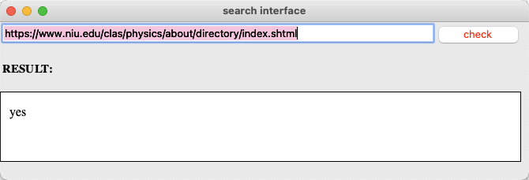
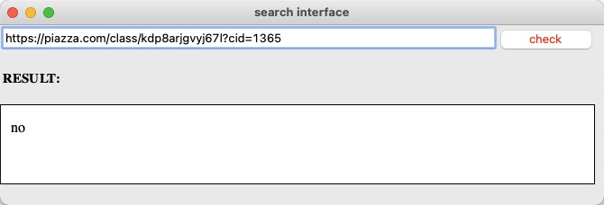

# Course Project

## Introduction
This repo is for CS410 course project option 2.2 Expert Search System. \
Our system is part of the automatic crawler for MP2, using which users can enter a URL link and the system will identify if the entered URL is a valid faculty directory page.
In order to finish the task, we retrieve the information on those websites and process data using text retrieval methods.
Then, we train several several machine learning models using the processed text data from labeled websites(positive/negative). 
After training, we do test and cross validation and then select the optimal model to save for future prediction. 
When the user enters a URL, the saved model will be retrieved and a result will be predicted using that model.

## Author
Zhenzhou Yang(zy29@illinois.edu) \
Rui Liu(ruiliu7@illinois.edu)


## Dataset

* Positive datasets 
  are the faculty web pages given by students used for mp2.1 (​https://docs.google.com/spreadsheets/d/198HqeztqhCHbCbcLeuOmoynnA3Z68cVx ixU5vvMuUaM/edit#gid=0​). The data is saved in positive_link.csv
* Negative datasets are non-directory web pages we collected online. The data is saved in negative_info.csv
* Positive/Negative Ratio 3:1


## Method

* Process the html data of labeled data set and get their text. 
* Use TF-IDF to filter text, select features, vectorize the data into the input of our models.
* Training models (sklearn)
    + SVM
        - SVC
        - LinearSVC
    + Naive Bayes
        - MultinomialNB
    + Tree
        - DecisionTreeClassifier
    + RandomForest
        - RandomForestClassifier
    + Linear
        - SGDClassifier
    + Adaptive Boosting
        - AdaBoostClassifier
* Save model (joblib)
* User interface (tkinker)




## Run
The code was tested using Python 3.7.

* Train the model
```angular2html
python3 select_model.py
```
* Predict a URL
```angular2html
python3 predict.py
```

## Demo
https://uofi.box.com/s/apzzkkdm40upm5rvkh3qpg8sob23o4a8
